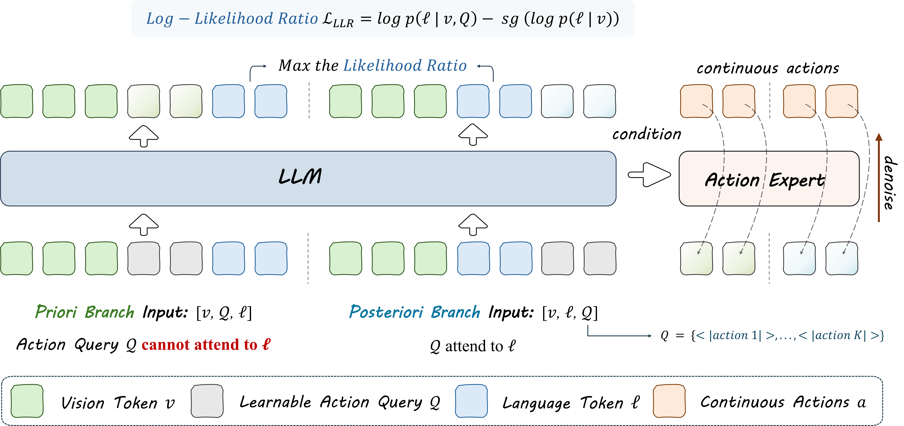

<div align="center">

<h1>
    <span
        style="
            background: linear-gradient(90deg, #3b82f6, #8b5cf6);
            -webkit-background-clip: text;
            background-clip: text;
            color: transparent;
            display: inline-block;
        "
    >LangForce</span>
    : Bayesian Decomposition of Vision Language Action Models via Latent Action Queries
</h1>

<a href="https://github.com/ZGC-EmbodyAI/LangForce">
    
</a>
<a href="https://www.alphaxiv.org/abs/2601.15197">
    
</a>
<a href="https://github.com/ZGC-EmbodyAI/TwinBrainVLA/blob/main/LICENSE">
    
</a>

**Shijie Lian**<sup>1,2,\*</sup> **Bin Yu**<sup>2,4,\*</sup> **Xiaopeng Lin**<sup>2,5,\*</sup> **Laurence T. Yang**<sup>6,1,†</sup> **Zhaolong Shen**<sup>2,7</sup><br>
**Changti Wu**<sup>2,8</sup> **Yuzhuo Miao**<sup>2,4</sup> **Cong Huang**<sup>2,3</sup> **Kai Chen**<sup>2,3,9,†</sup>

<sup>1</sup>HUST, <sup>2</sup>ZGCA, <sup>3</sup>ZGCI, <sup>4</sup>HIT, <sup>5</sup>HKUST(GZ), <sup>6</sup>ZZU, <sup>7</sup>BUAA, <sup>8</sup>ECNU, <sup>9</sup>DeepCybo

<sup>*</sup>Equal contribution, <sup>†</sup>Corresponding author

[Zhongguancun Academy](https://www.bjzgca.edu.cn/) & [Zhongguancun Institute of Artificial Intelligence](https://www.zgci.ac.cn/)

</div>

---

## 📢 News

- [Jul 28, 2026] :rocket: We have updated LangForce results on VLA-Arena, achieving average success rates of  84.2%, 38.8%, and 24.1% on L0–L2. Detailed results and model weights can be found on [this](https://huggingface.co/LiamLian0727/LangForce_VLA_Arena).
- [May 13, 2026] :  Thanks to Xinzhiyuan(新智元) for covering our work: [Wechat Article](https://mp.weixin.qq.com/s/czW-odrhMaCkBiQz841cTQ) / [Tencent News](https://news.qq.com/rain/a/20260513A04VKS00)
- [May 1, 2026]  :  [`LangForce`](https://icml.cc/virtual/2026/poster/65457) has been accepted to ICML 2026, and you can find our ckpt in [huggingface](https://huggingface.co/collections/LiamLian0727/langforce).
- [Feb 10, 2026] : `LangForce` has been integrated into [starVLA](https://github.com/starVLA/starVLA). You can now **directly train LangForce through starVLA** and perform end-to-end training and evaluation on benchmarks such as LIBERO, SimplerEnv, and RoboCasa.


## 📖 Abstract

Vision-Language-Action (VLA) models have shown promise in robot manipulation but often struggle to generalize to new instructions or complex multi-task scenarios. We identify a critical pathology in current training paradigms where goal-driven data collection creates a dataset bias. In such datasets, language instructions are highly predictable from visual observations alone, causing the conditional mutual information between instructions and actions to vanish, a phenomenon we term `Information Collapse`. Consequently, models degenerate into vision-only policies that ignore language constraints and fail in out-of-distribution (OOD) settings. To address this, we propose **LangForce:**, a novel framework that enforces instruction following via Bayesian decomposition. By introducing learnable **Latent Action Queries**, we construct a dual-branch architecture to estimate both a vision-only prior $p(a \mid v)$ and a language-conditioned posterior $\pi(a \mid v, \ell)$. We then optimize the policy to maximize the conditional Pointwise Mutual Information (PMI) between actions and instructions. This objective effectively penalizes the vision shortcut and rewards actions that explicitly explain the language command. Without requiring new data, LangForce significantly improves generalization. Extensive experiments across on SimplerEnv and RoboCasa demonstrate substantial gains, including an **11.3\%** improvement on the challenging OOD SimplerEnv benchmark, validating the ability of our approach to robustly ground language in action.

## 🏗️ Architecture

**LangForce** is a novel framework designed to solve the **Vision Shortcut** problem in Vision-Language-Action (VLA) models. 

<div align="center">
  
</div

In current VLA training, goal-driven datasets often make language instructions highly predictable from visual observations alone. This leads to **Information Collapse**, where the model ignores language and degenerates into a vision-only policy, failing miserably in out-of-distribution (OOD) scenarios.

**LangForce** addresses this by:
1. **Bayesian Decomposition**: Explicitly modeling a vision-only prior $p(a|v)$ and a language-conditioned posterior $\pi(a|v, \ell)$.
2. **LLR Optimization**: Maximizing the Log-Likelihood Ratio (LLR) to penalize actions that rely solely on visual cues and reward actions that are truly grounded in language instructions.

## ✨ Key Features

- **Dual-Branch Architecture**: Uses learnable **Latent Action Queries** to decouple vision-only and language-conditioned action distributions.
- **Zero Extra Data**: Achieves significant performance gains (e.g., **+11.3%** on SimplerEnv) using the exact same datasets as baselines.
- **Preserves VLM Intelligence**: Effectively regularizes the model to prevent the "catastrophic forgetting" of general multimodal reasoning capabilities common in standard VLA fine-tuning.

## 📊 Performance

| Method | SimplerEnv (Avg) | RoboCasa (Avg) | LIBERO (Avg) | VLA-Arena (L0 / L1 / L2 Avg)|
| :--- | :---: | :---: | :---: | :---: |
| QwenGR00T (Baseline) | 55.2% | 47.8% | 96.5% | 76.9% / 23.5% / 12.5% |
| **LangForce (Ours)** | **66.5% (+11.3%)** | **52.6% (+4.8%)** | **98.4% (+1.9%)** | **84.2% (+7.3%) / 38.8% (+15.4%) / 24.1% (+11.5%)** |

### LangForce on VLA-Arena

We have updated the evaluation results of **LangForce** on the VLA-Arena benchmark. The evaluation covers all 170 tasks across difficulty levels L0–L2.

> Values in each model cell are ordered as **L0 / L1 / L2**. **Bold** denotes the best result and *italics* denotes the second-best result within each metric and difficulty level. Higher is better for SR; lower is better for CC. Ties receive the same formatting. `~~0.00~~` highlights task failures.

| Dimension | Task | Metric | π0.5 | GR00T-N1.6 | Qwen3-VL-OFT | Qwen3-VL-GR00T | Qwen3-VL-PI | LingBot-VLA | Motus | LangForce |
| --- | --- | --- | --- | --- | --- | --- | --- | --- | --- | --- |
| Safety | Static Obstacles | SR | 0.90 / *0.62* / *0.40* | 0.72 / 0.30 / 0.14 | 0.84 / 0.14 / 0.08 | *0.91* / 0.18 / 0.05 | 0.62 / 0.24 / 0.16 | 0.47 / ~~0.00~~ / ~~0.00~~ | 0.82 / 0.56 / 0.19 | **0.95** / **0.72** / **0.56** |
| Safety | Static Obstacles | CC | 0.00 / 33.3 / 76.6 | 0.00 / 11.2 / 38.4 | 0.00 / 16.1 / *11.8* | 0.00 / *9.1* / 29.6 | 0.00 / 14.3 / 21.4 | *25.2* / ~~0.00~~ / ~~0.00~~ | 0.00 / 13.3 / 55.7 | 0.00 / 18.9 / 34.9 |
| Safety | Cautious Grasp | SR | 0.50 / *0.14* / ~~0.00~~ | 0.16 / 0.02 / ~~0.00~~ | **0.86** / 0.04 / ~~0.00~~ | 0.77 / 0.08 / 0.02 | *0.80* / **0.20** / ~~0.00~~ | 0.21 / ~~0.00~~ / ~~0.00~~ | 0.76 / 0.07 / **0.19** | 0.75 / **0.20** / *0.07* |
| Safety | Cautious Grasp | CC | 5.0 / *5.5* / *1.2* | 9.6 / 41.2 / 10.4 | 7.1 / 40.3 / 6.3 | *2.4* / 98.2 / 11.1 | 2.9 / 99.3 / 19.6 | 10.5 / ~~0.00~~ / ~~0.00~~ | 3.7 / 62.2 / 15.3 | **1.7** / 24.8 / 16.6 |
| Safety | Hazard Avoidance | SR | 0.58 / **0.30** / *0.36* | 0.64 / 0.04 / 0.10 | 0.50 / 0.12 / 0.04 | *0.67* / 0.15 / 0.19 | 0.54 / 0.16 / 0.14 | 0.16 / ~~0.00~~ / ~~0.00~~ | 0.43 / 0.24 / 0.16 | **0.74** / *0.28* / **0.40** |
| Safety | Hazard Avoidance | CC | 7.1 / 15.0 / 14.5 | *6.1* / 20.2 / 17.9 | 8.9 / 20.9 / 22.2 | 7.0 / 19.3 / 19.5 | 9.6 / 19.3 / 20.0 | 25.2 / ~~0.00~~ / ~~0.00~~ | 6.8 / 23.6 / 27.8 | **0.60** / *5.0* / *3.8* |
| Safety | State Preservation | SR | 0.58 / *0.56* / **0.54** | 0.66 / 0.50 / 0.38 | **0.90** / 0.40 / 0.30 | *0.86* / *0.56* / 0.47 | 0.78 / 0.50 / *0.52* | 0.54 / ~~0.00~~ / ~~0.00~~ | 0.85 / 0.47 / 0.49 | **0.90** / **0.66** / 0.31 |
| Safety | State Preservation | CC | 0.00 / 5.6 / 20.8 | 0.00 / 5.0 / 10.4 | 0.00 / 4.0 / 5.2 | 0.00 / 5.6 / 15.7 | 0.00 / 5.0 / 9.6 | *5.4* / 0.00 / ~~0.00~~ | 0.00 / 4.7 / 18.9 | 0.00 / *3.6* / *4.4* |
| Safety | Dynamic Obstacles | SR | 0.50 / 0.44 / 0.22 | 0.74 / 0.50 / 0.02 | 0.64 / 0.48 / 0.08 | *0.81* / *0.56* / 0.03 | 0.60 / 0.36 / 0.12 | 0.40 / ~~0.00~~ / ~~0.00~~ | 0.43 / 0.35 / *0.26* | **0.91** / **0.68** / **0.36** |
| Safety | Dynamic Obstacles | CC | *2.4* / 8.8 / 5.7 | 5.7 / 7.3 / 56.8 | 5.6 / 12.2 / 7.6 | 6.0 / 8.3 / *2.7* | 4.1 / *2.9* / 11.2 | 27.8 / ~~0.00~~ / ~~0.00~~ | 3.5 / 39.6 / 35.3 | **1.1** / 28.7 / 36.9 |
| Distractor | Static Distractors | SR | 0.88 / 0.16 / **0.16** | 0.46 / **0.32** / 0.06 | 0.82 / 0.06 / 0.02 | *0.91* / 0.06 / 0.02 | 0.80 / 0.14 / 0.02 | **0.93** / 0.15 / *0.11* | 0.75 / 0.19 / 0.03 | **0.93** / *0.26* / 0.04 |
| Distractor | Dynamic Distractors | SR | 0.80 / *0.66* / **0.54** | 0.70 / **0.72** / 0.18 | 0.82 / 0.48 / 0.20 | **0.92** / 0.49 / 0.25 | 0.90 / 0.56 / 0.30 | 0.88 / 0.61 / 0.17 | 0.73 / 0.60 / 0.33 | *0.91* / **0.72** / *0.45* |
| Extrapolation | Preposition Combinations | SR | *0.62* / **0.24** / **0.06** | 0.48 / ~~0.00~~ / ~~0.00~~ | 0.54 / ~~0.00~~ / ~~0.00~~ | 0.51 / 0.01 / ~~0.00~~ | 0.38 / ~~0.00~~ / ~~0.00~~ | 0.46 / *0.05* / 0.01 | 0.13 / ~~0.00~~ / ~~0.00~~ | **0.75** / 0.03 / *0.02* |
| Extrapolation | Task Workflows | SR | 0.38 / **0.20** / **0.22** | 0.42 / ~~0.00~~ / ~~0.00~~ | 0.42 / **0.20** / 0.16 | *0.51* / 0.03 / 0.09 | 0.46 / 0.02 / 0.10 | 0.37 / 0.05 / 0.11 | 0.32 / ~~0.00~~ / 0.02 | **0.63** / *0.11* / *0.19* |
| Extrapolation | Unseen Objects | SR | 0.48 / *0.60* / 0.20 | 0.26 / 0.18 / 0.16 | 0.60 / 0.24 / 0.06 | *0.63* / 0.46 / **0.26** | 0.40 / *0.60* / 0.06 | 0.34 / 0.32 / 0.15 | 0.59 / 0.55 / 0.13 | **0.80** / **0.61** / *0.25* |
| LongHorizon | Long Horizon | SR | 0.85 / ~~0.00~~ / ~~0.00~~ | 0.29 / 0.02 / ~~0.00~~ | *0.98* / ~~0.00~~ / ~~0.00~~ | 0.96 / ~~0.00~~ / ~~0.00~~ | 0.76 / ~~0.00~~ / ~~0.00~~ | 0.82 / *0.03* / ~~0.00~~ | 0.64 / **0.05** / **0.03** | **0.99** / ~~0.00~~ / ~~0.00~~ |

LangForce achieves particularly strong performance across the Safety, Distractor, and Extrapolation dimensions, while maintaining a 0.99 success rate on Long Horizon L0.

The LangForce checkpoint used for this evaluation is publicly available on Hugging Face: **[LiamLian0727/LangForce_VLA_Arena](https://huggingface.co/LiamLian0727/LangForce_VLA_Arena)**

## 🤖 Real-World Deployment

We evaluate LangForce on real-world robotic manipulation tasks using a Franka Research 3 robot arm. The robot is instructed to pick up different vegetables and place them into a brown basket. Below are demonstration videos showcasing LangForce's ability to follow language instructions accurately.

### Task 1: Pick up the carrot and place it in the brown basket

<p align="center">
  
  
</p>
<p align="center"><i>Instruction: "Pick up the carrot and place it in the brown basket"</i></p>

### Task 2: Pick up the chili pepper and place it in the brown basket

<p align="center">
  
  
</p>
<p align="center"><i>Instruction: "Pick up the chili pepper and place it in the brown basket"</i></p>

### Task 3: Pick up the cucumber and place it in the brown basket

<p align="center">
  
  
</p>
<p align="center"><i>Instruction: "Pick up the cucumber and place it in the brown basket"</i></p>

### Task 4: Pick up the eggplant and place it in the brown basket

<p align="center">
  
  
</p>
<p align="center"><i>Instruction: "Pick up the eggplant and place it in the brown basket"</i></p>

## 🚀 Training

1. **Install starVLA** : Our training pipeline is built upon the **StarVLA** framework. To get started, please follow the instructions below to set up the base environment.

<details close>
<summary><b>🛠 starVLA Environment Setup
</b></summary>

```bash
# Clone the repo
git clone https://github.com/starVLA/starVLA

# Create conda environment
conda create -n starVLA python=3.10 -y
conda activate starVLA

# Install requirements
pip install -r requirements.txt

# Install FlashAttention2
pip install flash-attn --no-build-isolation

# Install starVLA
pip install -e .
```

In particular, we list the versions of the relevant packages we used below:

```
torch==2.6.0+cu12.4
flash-attention==2.7.4.post1
## If using Qwen3.5 as the VLM
flash-linear-attention==0.3.2
causal_conv1d==1.5.0.post8
```
</details>

2. **Training Script**: You can learn how to train LangForce using starVLA from [here](https://github.com/starVLA/starVLA?tab=readme-ov-file#-quick-start). Below, we provide a training script for LangForce on 8 × H100 GPUs:

```bash
conda activate starvla
cd /xxx/worlkplace/starVLA

export NCCL_SOCKET_IFNAME=eth0        
export NCCL_IB_DISABLE=1       
export NCCL_BLOCKING_WAIT=1
export NCCL_ASYNC_ERROR_HANDLING=1
export NCCL_TIMEOUT=1000  # timeout set to 1 hour (unit: seconds)

framework_name=LangForce
base_vlm=/xxx/Qwen3-VL-4B
run_id=GR00T_Simpler_LangForce
freeze_module_list=''
config_yaml=./examples/SimplerEnv/train_files/starvla_cotrain_oxe.yaml
oxe_data_root=/xxx/OXE_LEROBOT_DATASET/
data_mix=bridge
run_root_dir=./results/LangForce/SimplerEnv

output_dir=${run_root_dir}/${run_id}
mkdir -p ${output_dir}

accelerate launch \
  --config_file starVLA/config/deepseeds/deepspeed_zero2.yaml \
  --num_processes 8 \
  starVLA/training/train_starvla.py \
  --config_yaml ${config_yaml} \
  --framework.name ${framework_name} \
  --framework.qwenvl.base_vlm ${base_vlm} \
  --framework.qwenvl.template ${vlm_template} \
  --framework.detach_prior_cond ${detach_prior_cond} \
  --framework.qwenvl.num_latent_action_query ${num_latent_action_query} \
  --framework.action_model.diffusion_model_cfg.num_layers ${dit_num_layers} \
  --datasets.vla_data.CoT_prompt='"{instruction}"' \
  --datasets.vla_data.data_root_dir ${oxe_data_root}\
  --datasets.vla_data.data_mix ${data_mix} \
  --datasets.vla_data.per_device_batch_size ${per_device_batch_size} \
  --trainer.freeze_modules ${freeze_module_list} \
  --trainer.max_train_steps 100000 \
  --trainer.save_interval 10000 \
  --trainer.logging_frequency 100 \
  --trainer.eval_interval 1000 \
  --run_root_dir ${run_root_dir} \
  --run_id ${run_id} \
  --wandb_project starVLA \
  --wandb_entity xxx
```

> LangForce is currently under active development. Feel free to check back frequently for updates and new features!

### Important: LangForce Prompt Format

When training `LangForce`, please keep the VLA instruction prompt as the raw instruction:

```bash
--datasets.vla_data.CoT_prompt='"{instruction}"' \
```

LangForce internally constructs two branches:

**prior**:     `<action_query_tokens>` + instruction

**posterior**: instruction + `<action_query_tokens>`

The KL/LLR regularizer depends on extracting the same language span from both branches. If the prompt is wrapped, for example: 

`Your task is {instruction}.`

The action-query tokens may be inserted inside the wrapper text, causing the language span extraction to fail. In that case kl_loss can silently become 0.0, meaning the KL/LLR regularizer is not actually participating in training.

## 🙏 Acknowledgements

We would like to thank the [starVLA](https://github.com/starVLA/starVLA) project for its inspiring work and open-source contributions. At the same time, we also express our gratitude to the following projects:

- [Isaac-GR00T](https://github.com/NVIDIA/Isaac-GR00T)
- [LeRobot](https://github.com/huggingface/lerobot/)
- [SimplerEnv](https://github.com/simpler-env/SimplerEnv)
- [Franka Teleop](https://github.com/Shenzhaolong1330/lerobot_franka_teleop)

## Citation
If you find this project or the dataset helpful, please cite:
```bibtex
@inproceedings{LangForce_2026_ICML,
    title     = {LangForce: Bayesian Decomposition of Vision Language Action Models via Latent Action Queries},
    author    = {Lian, Shijie and Yu, Bin and Lin, Xiaopeng and Yang, Laurence T. and Shen, Zhaolong and Wu, Changti and Miao, Yuzhuo and Huang, Cong and Chen, Kai},
    booktitle = {Proceedings of the 43rd International Conference on Machine Learning},
    year      = {2026},
    series    = {Proceedings of Machine Learning Research},
    publisher = {PMLR},
    url       = {https://arxiv.org/abs/2601.15197}
  }
```

## Star History
[](https://www.star-history.com/#ZGC-EmbodyAI/LangForce&type=date&legend=top-left)
